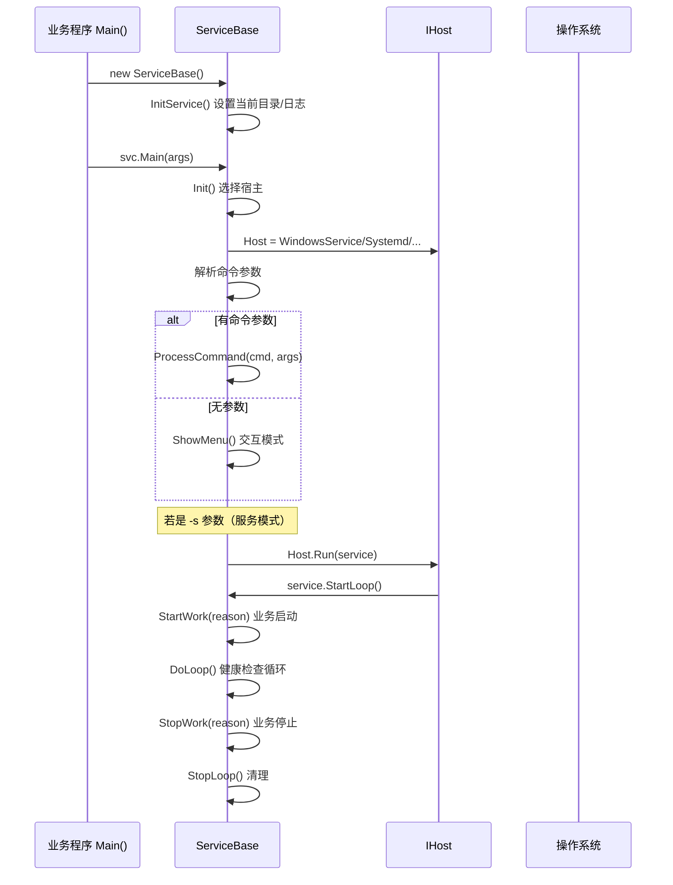
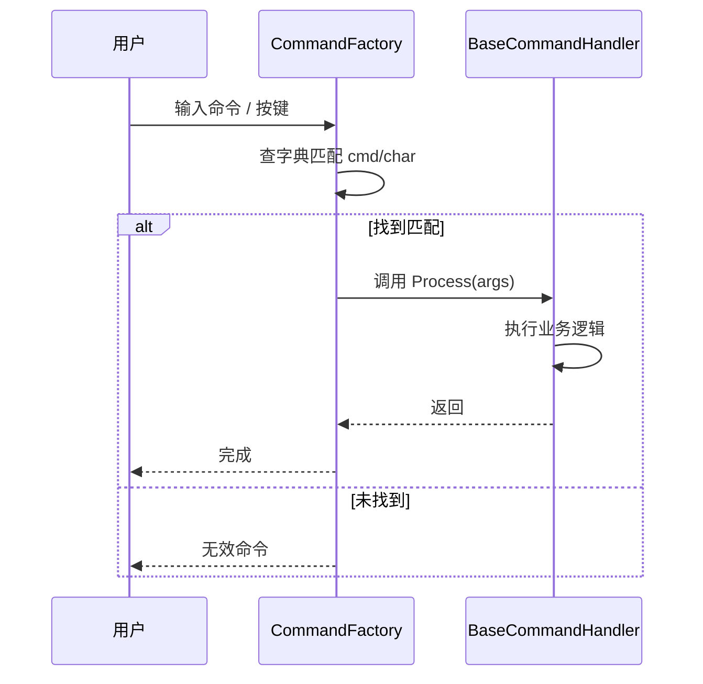
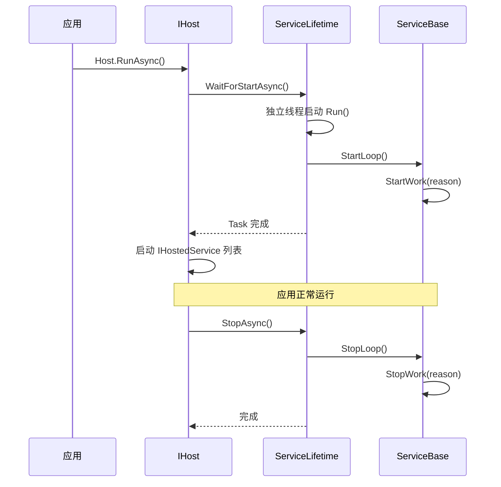
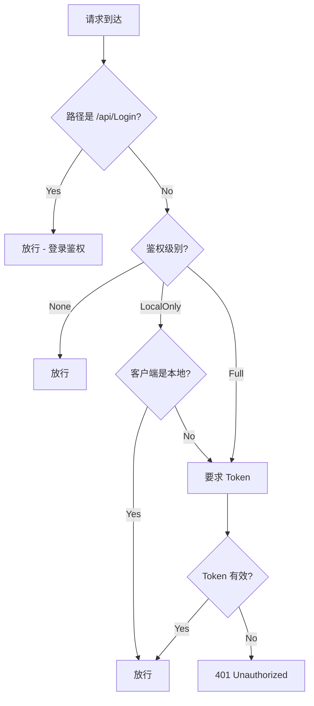

# NewLife.Agent 架构设计

> 版本：v1.0 | 日期：2026-07-15
> 需求对应：[需求文档](需求文档.md) | 功能清单：[功能清单](功能清单.md)

## 1. 整体架构

### 1.1 分层架构

```
┌─────────────────────────────────────────────────────┐
│                    业务应用层                         │
│   控制台应用 / ASP.NET Core / Worker Service / 其它   │
└──────────────┬──────────────────────────────────────┘
               │ 继承 ServiceBase / 调用 UseAgentService()
┌──────────────▼──────────────────────────────────────┐
│              NewLife.Agent 框架层                     │
│  ┌────────────────────────────────────────────────┐ │
│  │             服务抽象层 ServiceBase               │ │
│  │   ServiceName / Running / StartWork / StopWork  │ │
│  │   Main() → Init() → DoLoop() → 健康检查          │ │
│  └──────────────┬─────────────────────────────────┘ │
│  ┌──────────────▼─────────────────────────────────┐ │
│  │             宿主抽象层 IHost / DefaultHost       │ │
│  │   Install / Remove / Start / Stop / Restart     │ │
│  │   IsInstalled / IsRunning / Run / QueryConfig   │ │
│  └──────────────┬─────────────────────────────────┘ │
│  ┌──────────────▼─────────────────────────────────┐ │
│  │             平台实现层                           │ │
│  │  WindowsService / WindowsAutorun / Systemd      │ │
│  │  Procd / RcInit / SysVinit / OSXLaunch         │ │
│  └──────────────┬─────────────────────────────────┘ │
│  ┌──────────────▼─────────────────────────────────┐ │
│  │             命令执行层                           │ │
│  │  CommandFactory → BaseCommandHandler 派生类     │ │
│  │  反射自动发现 / 命令映射 / 冲突检测 / 菜单可见性  │ │
│  └────────────────────────────────────────────────┘ │
│  ┌────────────────────────────────────────────────┐ │
│  │           Web 管理面板层                        │ │
│  │  AgentWebPanel (HttpServer) → ApiController    │ │
│  │  Token鉴权 / 登录防护 / 扩展面板 / 前端静态文件  │ │
│  └────────────────────────────────────────────────┘ │
│  ┌────────────────────────────────────────────────┐ │
│  │             配置模型层                           │ │
│  │  Setting / ServiceModel / ServiceConfig         │ │
│  │  SystemdSetting / Menu / PanelExtension        │ │
│  └────────────────────────────────────────────────┘ │
└─────────────────────────────────────────────────────┘
┌─────────────────────────────────────────────────────┐
│                NewLife.Core 基础库                    │
│  日志(XTrace) / 配置(Config<T>) / 网络(HttpServer)   │
│  反射(AssemblyX) / 定时器(TimerX) / 内存池           │
└─────────────────────────────────────────────────────┘
```

### 1.2 设计原则

| 原则 | 说明 |
|------|------|
| **面向继承** | 业务程序只需继承 `ServiceBase`，重写 `StartWork`/`StopWork` |
| **面向组合** | 平台能力通过 `IHost` 对象组合到 `ServiceBase`，不耦合业务代码 |
| **面向运维** | 命令与监控能力内置，无需额外守护包装器 |
| **单一事实源** | `Setting.Current` 作为统一配置入口，代码构造与配置文件双向同步 |
| **跨平台抽象** | `IHost` 接口统一服务管理操作，各平台实现差异封装在派生类中 |

## 2. M1 平台工具类

### 2.1 职责

提供辅助工具类，支撑其他模块的跨平台能力。

### 2.2 核心组件

| 组件 | 所在工程 | 说明 |
|------|----------|------|
| `ServiceHelper` | NewLife.Agent | 运行时检测（dotnet/java）、工作目录分析 |
| `ServiceModel` | NewLife.Agent | 服务安装数据模型 |
| `ServiceConfig` | NewLife.Agent | 服务查询配置模型 |
| `SystemdSetting` | NewLife.Agent | Systemd 配置生成 |
| `Advapi32` | NewLife.Agent | Windows SCM API P/Invoke |
| `Desktop` | NewLife.Agent | Windows 桌面进程启动 |
| `NativeMethods` | NewLife.Agent | Windows 内存整理 API |
| `PowerStatus` | NewLife.Agent | Windows 电源状态查询 |
| `Menu` | NewLife.Agent | 菜单模型 |

## 3. M2 配置管理

### 3.1 职责

统一管理服务配置，支持代码构造与配置文件的自动同步。

### 3.2 核心组件

| 组件 | 所在工程 | 说明 |
|------|----------|------|
| `Setting` | NewLife.Agent | 主配置类，继承 `Config<Setting>`，持久化到 `Agent.config` |
| `ServiceModel` | NewLife.Agent | 服务安装数据模型（ServiceName/DisplayName/FileName/Arguments 等） |
| `ServiceConfig` | NewLife.Agent | 服务查询数据模型（Name/DisplayName/FilePath/AutoStart 等） |
| `SystemdSetting` | NewLife.Agent | Systemd `.service` 文件配置模型，含 `Build()` 生成方法 |

### 3.3 配置初始化流程

```
ServiceBase 构造函数
  → Setting.Current 加载配置文件
  → 从代码属性赋值 ServiceName/DisplayName/Description
  → Init() 中双向同步：代码→配置→代码（配置优先）
  → 配置中缺失的值从程序集元数据补充
  → Setting.Save() 持久化
```

### 3.4 设计决策

| 决策 | 选项 | 选择 | 理由 |
|------|------|------|------|
| 配置格式 | XML / JSON | XML | `Config<T>` 基类的默认格式，向后兼容 |
| 热加载 | 自动 / 手动 | 自动 | `Config<T>` 内置文件监控热加载 |

## 4. M3 服务抽象与跨平台宿主

### 4.1 职责

提供统一的 `ServiceBase` 基类和跨平台宿主实现，隐藏操作系统服务管理差异。

### 4.2 核心组件

| 组件 | 所在工程 | 说明 |
|------|----------|------|
| `ServiceBase` | NewLife.Agent | 服务基类，统一入口 `Main()`、生命周期管理、健康检查调度 |
| `IHost` | NewLife.Agent | 宿主接口契约：安装/卸载/启停/状态查询 |
| `DefaultHost` | NewLife.Agent | 宿主角色的抽象基类，兜底实现 |
| `WindowsService` | NewLife.Agent | Windows SCM 服务，Win32 API 实现 |
| `WindowsAutorun` | NewLife.Agent | Windows 登录自启动，注册表 Run 项 |
| `Systemd` | NewLife.Agent | Linux systemd，`.service` 文件 + `systemctl` |
| `Procd` | NewLife.Agent | OpenWrt procd，init 脚本 + pid 文件 |
| `RcInit` | NewLife.Agent | 传统 Linux init.d，init 脚本 |
| `SysVinit` | NewLife.Agent | SysVinit 兼容识别 |
| `OSXLaunch` | NewLife.Agent | macOS LaunchAgent，plist + `launchctl` |

### 4.3 关键流程

#### 服务启动流程



#### 平台选择策略

```mermaid
flowchart TD
  A[ServiceBase.Init()] --> B{是否 Windows?}
  B -->|Yes| C{UseAutorun?}
  C -->|Yes| D[WindowsAutorun]
  C -->|No| E[WindowsService]
  B -->|No| F{是否 macOS?}
  F -->|Yes| G[OSXLaunch]
  F -->|No| H{Systemd 可用?}
  H -->|Yes| I[Systemd]
  H -->|No| J{Procd 可用?}
  J -->|Yes| K[Procd]
  J -->|No| L{RcInit 可用?}
  L -->|Yes| M[RcInit]
  L -->|No| N[DefaultHost 兜底]
```

## 5. M4 命令行运维体系

### 5.1 职责

提供"命令行 + 交互菜单"双模式运维入口，支持自动化和人工运维。

### 5.2 核心组件

| 组件 | 所在工程 | 说明 |
|------|----------|------|
| `ICommandHandler` | NewLife.Agent | 命令处理器接口契约 |
| `BaseCommandHandler` | NewLife.Agent | 命令处理器基类，含 `Cmd`/`Description`/`ShortcutKey` |
| `CommandFactory` | NewLife.Agent | 命令工厂：反射扫描、构建字典、处理分发 |
| `CommandConst` | NewLife.Agent | 命令常量定义 |
| `Menu` | NewLife.Agent | 菜单模型，含按键/名称/命令/回调 |

### 5.3 命令映射表

| 命令字符串 | 处理类 | 快捷键 | 菜单可见性条件 |
|-----------|--------|:------:|---------------|
| `-i` | `Install` | 2 | 服务未安装 |
| `-install` | `InstallAndStart` | — | 始终可见 |
| `-reinstall` | `Reinstall` | — | 始终可见 |
| `-u` | `Remove` | 2 | 服务已安装 |
| `-uninstall` | `Uninstall` | — | 始终可见 |
| `-start` | `Start` | 3 | 服务已安装且未运行 |
| `-stop` | `Stop` | 3 | 服务正在运行 |
| `-restart` | `Restart` | 4 | 服务正在运行 |
| `-status` | `ShowStatus` | 1 | 始终可见 |
| `-run` | `RunSimulation` | 5 | 始终可见 |
| `-s` | `RunService` | — | 不显示菜单 |
| `-watch` | `WatchDog` | 7 | 配置了守护服务列表 |

### 5.4 关键流程



### 5.5 扩展机制

自定义命令只需三步：

1. 新建类继承 `BaseCommandHandler(service)`
2. 构造函数中设置 `Cmd`、`Description`、`ShortcutKey`
3. 实现 `Process(String[] args)`

`CommandFactory` 在构造时通过反射自动发现所有 `BaseCommandHandler` 派生类，无需手动注册。子类型优先级高于基类型，支持覆盖框架内置命令。

## 6. M5 健康监控与自愈

### 6.1 职责

运行期监控进程健康指标，超标时自动重启实现自愈。

### 6.2 核心组件

| 组件 | 所在工程 | 说明 |
|------|----------|------|
| `ServiceBase.DoCheck()` | NewLife.Agent | 主检查循环调度 |
| `ServiceBase.CheckMemory()` | NewLife.Agent | 内存阈值检查 |
| `ServiceBase.CheckThread()` | NewLife.Agent | 线程数检查 |
| `ServiceBase.CheckHandle()` | NewLife.Agent | 句柄数检查 |
| `ServiceBase.CheckAutoRestart()` | NewLife.Agent | 定时重启检查 |
| `ServiceBase.FreeMemory()` | NewLife.Agent | 主动内存整理 |

### 6.3 关键流程

```mermaid
sequenceDiagram
  participant Loop as DoLoop()
  participant Check as DoCheck()
  participant Restart as Host.Restart()
  participant OS as 操作系统

  Loop->>Check: 按 WatchInterval 周期调用
  Check->>Check: CheckMemory() 检查工作集内存
  alt 超标
    Check->>Restart: Host.Restart()
    Restart->>OS: 重启进程
    Check-->>Loop: return (退出循环)
  end
  Check->>Check: CheckThread() 检查线程数
  alt 超标
    Check->>Restart: Host.Restart()
    Check-->>Loop: return
  end
  Check->>Check: CheckHandle() 检查句柄数
  alt 超标
    Check->>Restart: Host.Restart()
    Check-->>Loop: return
  end
  Check->>Check: CheckAutoRestart() 定时重启
  alt 到达时间
    Check->>Restart: Host.Restart()
    Check-->>Loop: return
  end
  Check->>Check: 看门狗检查
  Check->>WatchDog: 拉起被守护服务
  Check-->>Loop: 继续循环
```

### 6.4 设计决策

| 决策 | 选项 | 选择 | 理由 |
|------|------|------|------|
| 自愈方式 | 外部进程重启 / 内部线程重启 | 外部进程重启 | 内存泄漏/线程泄漏等问题内部无法彻底恢复，外部重启更彻底 |
| 重启策略 | 立即重启 / 窗口内重启 | 窗口内重启 | `RestartTimeRange` 支持限制重启时段，避免高峰期重启 |
| 看门狗实现 | 内嵌检查 / 独立进程 | 内嵌检查 | 简化部署，无需额外进程 |

## 7. M6 Host 集成扩展

### 7.1 职责

桥接 NewLife.Agent 与 `Microsoft.Extensions.Hosting`，使 ASP.NET Core / Worker Service 应用可无缝切换为系统服务。

### 7.2 核心组件

| 组件 | 所在工程 | 说明 |
|------|----------|------|
| `ServiceLifetime` | NewLife.Extensions.Hosting.AgentService | 继承 `ServiceBase` + 实现 `IHostLifetime` |
| `ServiceLifetimeHostBuilderExtensions` | NewLife.Extensions.Hosting.AgentService | `UseAgentService()` 扩展方法 |
| `ServiceLifetimeOptions` | NewLife.Extensions.Hosting.AgentService | Options 模式配置服务元数据 |

### 7.3 生命周期桥接



### 7.4 设计决策

| 决策 | 选项 | 选择 | 理由 |
|------|------|------|------|
| 集成方式 | 继承 ServiceBase / 扩展方法 | 扩展方法 | 不侵入 HostBuilder 原有链式调用风格 |
| 生命周期实现 | 直接实现 IHostLifetime / 适配器模式 | 继承 ServiceBase + 实现 IHostLifetime | 复用 ServiceBase 全部能力 |

## 8. M7 Web 管理面板

### 8.1 职责

提供基于浏览器的服务运维界面，无需登录服务器即可查看状态、执行操作。

### 8.2 核心组件

| 组件 | 所在工程 | 说明 |
|------|----------|------|
| `AgentWebPanel` | NewLife.Agent | Web 面板主类，管理 HttpServer 生命周期、路由注册、Token 管理 |
| `ApiController` | NewLife.Agent | RESTful API 控制器，处理状态/控制/配置/日志/鉴权请求 |
| `PanelExtension` | NewLife.Agent | 扩展面板数据模型，支持第三方注册自定义面板页 |
| `LoginRateLimiter` | NewLife.Agent | 登录爆破防护，基于 IP 的失败计数与临时封锁 |
| `DiskMonitor` | NewLife.Agent | 跨平台磁盘 IOPS 采集 |
| `PdhHelper` | NewLife.Agent | Windows PDH API 封装 |

### 8.3 API 路由

```
/api/Login        POST  登录鉴权，签发 Bearer Token
/api/Status       GET   获取服务状态
/api/Control      POST  启停控制 (start/stop/restart)
/api/ConfigMetadata GET 获取配置元数据（三列布局）
/api/UpdateConfig POST  更新配置（白名单，密码除外）
/api/ChangePassword POST 修改密码（校验旧密码）
/api/Logs         GET   读取日志（支持文件/行数/级别过滤）
/api/LogFiles     GET   获取日志文件列表
/api/WatchDog     GET   获取看门狗监控的服务状态列表
/api/Extensions   GET   获取扩展面板列表
/api/Health       GET   获取健康指标（内存/线程/句柄/GC 等）
/*                GET   静态文件（内嵌 index.html / favicon.ico）
```

### 8.4 鉴权机制



### 8.5 路由注册规则

```
精确匹配优先于通配符：
/api/* → ApiController（控制器自行鉴权，Login 不鉴权）
/*     → 静态文件（内嵌资源 fallback）
```

### 8.6 设计决策

| 决策 | 选项 | 选择 | 理由 |
|------|------|------|------|
| Web 服务器 | 内置 HttpServer / Kestrel 独立进程 | 内置 HttpServer | 零额外依赖，与主进程同生命周期 |
| 前端方案 | 内嵌 SPA / 后端渲染 | 内嵌 HTML | 简化部署，一个 DLL 包含全部资源 |
| 鉴权方案 | Session / JWT / Bearer Token | Bearer Token | 无状态、适合 AJAX 调用、实现简单 |

## 9. 关键设计决策

| 决策 | 选项 | 选择 | 理由 |
|------|------|------|------|
| 服务基类模式 | 继承式 / Fluent API 委托式 | 继承式 | 与 .NET 原生 `BackgroundService` 风格一致，学习成本低 |
| 跨平台宿主发现 | 静态检测 / 运行时检测 | 运行时静态检测 | 编译时即可确定可用宿主，避免运行时异常 |
| 命令处理器发现 | 手动注册 / 反射自动发现 | 反射自动发现 | 零配置，新增命令无需修改框架代码 |
| Web 面板鉴权 | 无鉴权 / 简单鉴权 / Token | Token Bearer | 无状态、安全、适合 RESTful API |
| 配置管理 | 硬编码 / 配置文件 / 双向同步 | 双向同步 | 代码提供默认值，配置文件覆盖，持久化保留 |
| Systemd 文件 | 手动创建 / 自动生成 | 自动生成 | 安装服务时自动写入 `.service` 文件 |
| 日志 | 控制台 / 文本文件 / 数据库 | 文本文件 + 控制台 | 使用 `XTrace` 统一日志，Web 面板可在线查看 |
| 前端框架 | Vue / React / 原生 HTML | 原生 HTML | 零依赖、一个 DLL 包含全部资源、无需 node_modules |

---

> **文档版本**：v1.0  
> **创建日期**：2026-07-15  
> **关联文档**：[需求文档](需求文档.md)、[功能清单](功能清单.md)、[使用与运维手册](./Agent-使用与运维手册.md)
